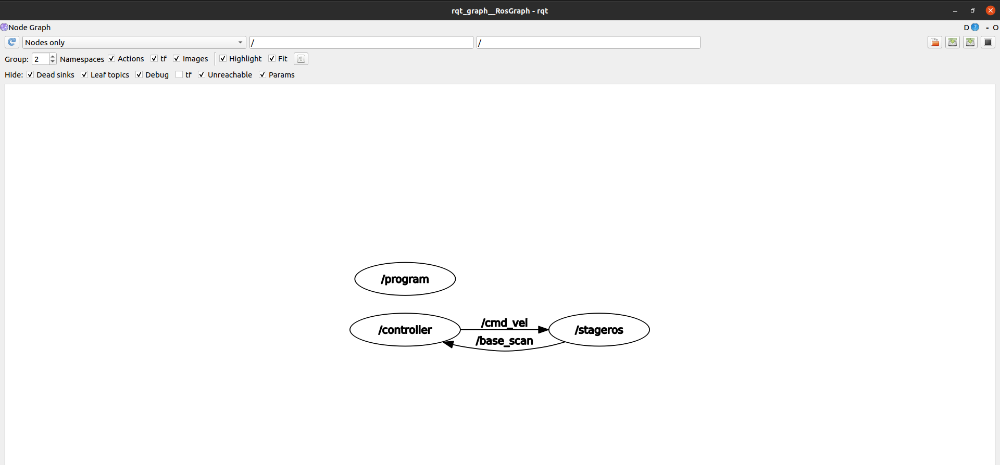

# assignment-2_Research_Track-1

##ABSTRACT 
A robot moves autonomously on a 2D TRACK and its speed can be controlled with help of a simple UI using keyboard keys "w" and "s" on the terminal. 

##INTRODUCTION
This assignment is a simple replica of an autonomous robot moving on a 2D Track and its speed can be controlled. In order to make this possible there are 2 different programs required one to avoid robot from collision and another to control its speed. Details of which are described in Methodology section.

##INSTALLATION AND RUNNING

Open three different sections in a terminal. On one section type "roscore &". Then follow the following steps

###1. Use command "source devel/setup.bash" on your workspace root folder.
###2. Then "Catkin_make"
###3. "rosrun stage_ros stageros $(rospack find project)/world/my_world.world".

On the second section :

###1. Repeat the first two commands from the first section mentioned above.
###2. "rosrun project program"

On the third section :

###1. Repeat the first two commands from the first section mentioned above.
###2. "rosrun project controller"

Now in the third section you will be able to find the following comments:

" PRESS : w to increase speed (max speed 10
  PRESS : s to decrease speed.  
  current speed: 0.000000  "
  
Pressing "w" and then enter will make the robot move. Then simultaneously pressing w and then enter will make the robot speed increase. In order to stop the robot press s and then enter until you find the speed of robot to be 0. 
Be sure to let robot turn with slow speeds so that it doesn't crash in the walls.

## METHODOLOGY

The nodes work as shown from the rqt_graph:

The stageros node is from the folder world which is already given for the assignment.
The controller node guides the robot to follow the track without any collision and also it offers services to increase or decrease the speed of the robot.
The program node is used for providing correct services to controller.

Logic behind the autonomous working robot (find the code in the prograam.cpp):

The robot has laser sensors attached to it which continously provides some readings. 
We divide these readings into three equal sectors in order to help the robot determine its distance from the walls of the track.
These three sectors determines which side of the robot is actually approaching the wall of track i.e either left, right or centre. Whenever readings from a certain sector becomes less than the defined threshold, the robot must allign itself in order to continue without crashing. 

Logic behind the speed control of the robot (find code in controller.cpp)

The controller sends request to the program to advertise the service once it advertise the service the controller program is designed to increase and decrease the speed of the robot, on pressing "w" and then "enter" the robot starts moving with an initial speed of 1 and max speed of 10.

The service racetrack.srv defined in srv folder it takes the char commands and gives output speed(float 32)

 
